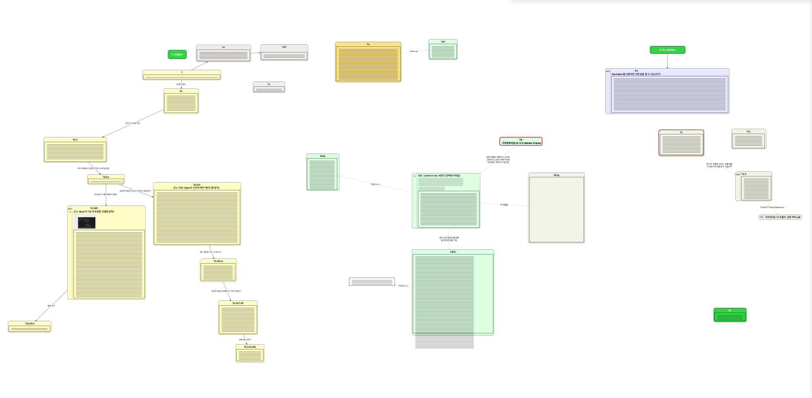

# Visual Understanding Environment (VUE) - 한국어 안내서



VUE(Visual Understanding Environment)는 Tufts University에서 개발한 Java/Swing 기반의 개념 지도(Concept Map), 수업, 발표 도구입니다. 이 저장소의 주 목적은 오래된 VUE 2.x/3.x 계열 소스코드를 최신 Java 런타임인 **OpenJDK 25**에서 다시 빌드하고 실행할 수 있도록 포팅하고 현대화하는 것입니다.

이 문서는 프로젝트의 전체 구조, 포팅 과정에서 해결된 주요 이슈, 한국어 IME 안정화 기법 및 수정/추가된 키보드 단축키 목록을 설명합니다.

---

## 1. 프로젝트 목적 및 현재 상태

현재 개발 환경의 Java 및 빌드 명세는 다음과 같습니다:
- **Java**: OpenJDK 25.0.2
- **Ant**: Apache Ant 1.10.17
- **현재 버전**: `4.1.5` (macOS 패키징 앱 버전 동일)

기존 VUE는 Java 1.4 ~ 1.6 시절의 API, Ant 빌드 설정, macOS 패키징 관례, 브라우저 Applet 연동 및 내부 JDK API에 강하게 의존하고 있었습니다. 본 저장소에서는 이러한 제약 사항들을 소스코드 수준에서 우회하거나 최신 공용 API로 현대화하여 별도의 실행 인자(JVM 옵션) 없이도 안정적으로 구동되는 환경을 구축했습니다.

---

## 2. 저장소 구조

| 경로                           | 내용                                                                                |
| ------------------------------ | ----------------------------------------------------------------------------------- |
| `VUE2/src`                     | VUE 본체 소스코드. Ant `build.xml`, Java/Swing 코드, 리소스, macOS 패키징 파일 포함 |
| `VUE2/lib`                     | VUE가 사용하는 서드파티 JAR 라이브러리 모음 (XML, RDF, Swing, Castor 등)            |
| `VUE2/test`                    | JUnit 및 OSID 관련 테스트/검증 코드                                                 |
| `VUE2/jnilibs`                 | 플랫폼별 네이티브 라이브러리 위치                                                   |
| `VUE2/MacOS`, `VUE2/src/MacOS` | 구 macOS 패키징 리소스 (Info.plist 등)                                              |
| `README.md`                    | 한국어로 작성된 프로젝트 기본 안내서                                                |
| `README.en.md`                 | 영어로 작성된 원래의 프로젝트 기본 안내서                                           |

---

## 3. 빌드 및 실행 방법

프로젝트는 Ant를 기반으로 빌드됩니다. `VUE2/src` 디렉터리에서 작업을 진행합니다.

### 컴파일
```sh
cd VUE2/src
ant compile
```

### 단일 JAR 생성
```sh
ant jar
```
생성된 JAR 파일은 `VUE2/src/build/VUE.jar` 경로에 배치됩니다.

### macOS App Bundle (.app) 생성
```sh
ant mac
# 또는 ant clean2 mac-dist
```
빌드가 완료되면 `VUE2/src/build/MacDist/VUE.app` 경로에 독립적으로 실행 가능한 macOS 애플리케이션 패키지가 생성됩니다.

---

## 4. JDK 25 포팅 및 현대화 작업 요약

### 1) Ant 컴파일 레벨 Java 8로 상향
- 기존 `<property name="target.version" value="1.6"/>` 설정을 `1.8`로 상향하여 JDK 25 `javac` 컴파일러가 거부하는 현상을 해결했습니다.

### 2) Applet 및 AOL Instant Messenger(AIM) 레거시 제거
- 브라우저 연동 플러그인인 Applet 관련 코드(`VueApplet.java`, Zotero 브라우저 연동 기능 등)와 현재 서비스가 완전히 종료된 AIM 협업 기능 및 관련 라이브러리(`joscar.jar`)를 삭제하여 소스 컴파일과 런타임 의존성을 정리했습니다.

### 3) Castor XML 직렬화 내부 JDK API 의존성 해결
- `castor.properties`에서 JDK 내부 패키지(`com.sun.org.apache.xerces.internal.*`)를 직접 지정하던 설정을 제거하고, VUE JAR에 내장된 공용 Xerces 파서 구현(`org.apache.xerces.parsers.SAXParser`)을 사용하도록 교체하여 모듈 시스템 접근 예외를 방지했습니다.

### 4) macOS Application Event API 현대화
- JDK 25에서 제거된 Apple 전용 `com.apple.eawt.ApplicationListener` 대신 JDK 9+ 표준 API인 `java.awt.Desktop`의 핸들러(About, Preferences, Open File, Quit)를 사용하도록 교체했습니다. 이로써 Finder에서 `.vue` 파일을 더블 클릭해 앱을 구동하고 실행 중인 인스턴스에서 해당 파일을 즉시 여는 기능이 정상 작동합니다.

---

## 5. 한국어 IME 입력 안정화

Swing 기반 리치 텍스트 에디터(`SimplyHTML` 에디터 컴포넌트 포함)에서 한글 자간이 뭉개지거나, 공백을 입력할 때 커서 위치가 붕괴되고 폰트 크기가 불일치하는 구조적인 문제를 해결했습니다.

1. **조합 중 폰트 불일치 해결**:
   - IME 조합 중인 문자(Composed Text)가 입력될 때 임시 스타일 속성에 의해 기본 폰트(Arial 등)로 렌더링되면서 자간 계산이 망가지는 현상을 막기 위해, `CaretListener`를 추가하여 캐럿 변경 시 현재 선택 노드의 폰트 속성으로 갱신(`forceInputAttributes`)하고, `DocumentFilter`를 통해 유입 텍스트의 폰트 및 스타일 속성을 정규화(`normalizeCharacterAttributes`)했습니다.
2. **공백 입력 시 자간 붕괴 방지**:
   - `SHTMLEditorPane` 내부에 정의된 `spaceAction`이 일반 공백 대신 비유동 공백(`&nbsp;`)을 삽입하며 단락을 강제로 재조합(Reconstruct HTML)하는 과정에서 한글 IME 조합이 뭉개지는 현상이 있었습니다.
   - `spaceAction`을 오버라이딩하여 단순 공백 문자(`" "`)를 삽입하는 `replaceSelection(" ")`으로 교체함으로써 HTML 재구성을 차단하고 입력 흐름의 안정성을 유지했습니다.

---

## 6. 추가 및 수정된 키보드 단축키 목록

포팅 및 사용성 개선 과정에서 다른 텍스트 편집기 기능과의 충돌을 방지하고 작업 효율을 높이기 위해 수정/추가된 키보드 단축키 테이블입니다.

| 기능                                 | 기존 단축키       | 변경/추가 단축키       | 적용 플랫폼 | 설명                                                                                                             |
| :----------------------------------- | :---------------- | :--------------------- | :---------- | :--------------------------------------------------------------------------------------------------------------- |
| **Zoom In** (화면 확대)              | `Cmd + =`         | **`Cmd + =`** (유지)   | 모든 플랫폼 | 에디터 화면의 줌 배율을 확대합니다.                                                                              |
| **Zoom Out** (화면 축소)             | `Cmd + -`         | **`Cmd + -`** (유지)   | 모든 플랫폼 | 에디터 화면의 줌 배율을 축소합니다.                                                                              |
| **Font Bigger** (글자 크기 증가)     | `Shift + Cmd + =` | **`Ctrl + =`**         | macOS 전용  | 선택한 노드의 폰트 크기를 `1pt` 증가시킵니다. (macOS의 단축키 충돌 방지)                                         |
| **Font Smaller** (글자 크기 감소)    | `Shift + Cmd + -` | **`Ctrl + -`**         | macOS 전용  | 선택한 노드의 폰트 크기를 `1pt` 감소시킵니다. (최소 `7pt`까지 지원, 단축키 충돌 방지)                            |
| **Font Weight Increase** (굵기 증가) | 기존 Bold 토글    | **`Cmd + B`**          | 모든 플랫폼 | 폰트의 굵기(font weight)를 100 단위로 증가시킵니다. (100 ~ 900 순환, 기본값 400)                                 |
| **Font Weight Decrease** (굵기 감소) | -                 | **`Shift + Cmd + B`**  | 모든 플랫폼 | 폰트의 굵기(font weight)를 100 단위로 감소시킵니다. (900 ~ 100 순환)                                             |
| **Copy Style** (스타일 복사)         | `Shift + Cmd + C` | **`Option + Cmd + C`** | macOS 전용  | 선택된 요소의 스타일(색상, 테두리 등)을 스타일 버퍼에 복사합니다. (텍스트 복사 단축키와의 충돌 방지)             |
| **Paste Style** (스타일 붙여넣기)    | `Shift + Cmd + V` | **`Option + Cmd + V`** | macOS 전용  | 스타일 버퍼에 저장된 스타일을 선택한 요소에 적용합니다. (텍스트 붙여넣기 단축키와의 충돌 방지)                   |
| **Capture Style to Queue**           | -                 | **`c`**                | 모든 플랫폼 | 선택된 단일 요소의 스타일을 최근 사용 스타일 큐(최대 5개, 중복 제어 및 LRU)에 임시 보관합니다.                   |
| **Apply Previous Style**             | -                 | **`[`**                | 모든 플랫폼 | 최근 사용 스타일 큐의 이전 스타일을 Formatting Palette와 스타일 버퍼에 적용하여 기본 그리기 스타일로 지정합니다. |
| **Apply Next Style**                 | -                 | **`]`**                | 모든 플랫폼 | 최근 사용 스타일 큐의 다음 스타일을 Formatting Palette와 스타일 버퍼에 적용하여 기본 그리기 스타일로 지정합니다. |
| **Paste Style Alias**                | -                 | **`!`**                | 모든 플랫폼 | 큐 순환 등을 통해 스타일 버퍼에 로드된 스타일을 현재 선택 노드에 즉시 적용합니다. (`Option-Cmd-V` 단축어 기능)   |

> [!NOTE]
> macOS 이외의 운영체제(Windows, Linux 등)에서는 스타일 복사(`Shift-Cmd-C` / `Ctrl-Shift-C`) 및 붙여넣기(`Shift-Cmd-V` / `Ctrl-Shift-V`)에 관한 기존 단축키가 그대로 유지됩니다.
